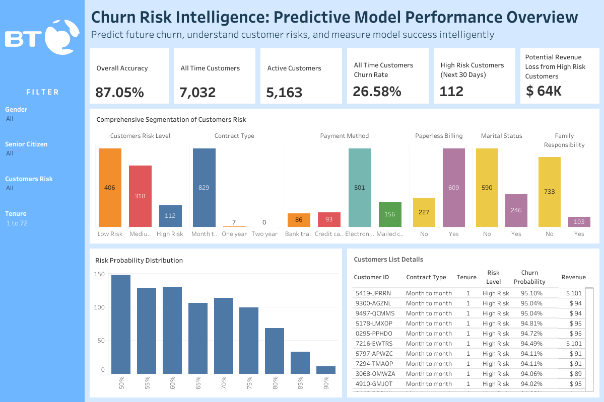

# 📊 Predictive Analytics: Building a Customer Churn Prediction Model

An end to end machine learning project to proactively identify customers at risk of churning, using Python, Pandas, and a recall optimized Random Forest model.

## 📊 Interactive Dashboard Preview

🔗 [View the full interactive dashboard on Tableau Public](https://public.tableau.com/views/CustomerChurnRiskIntelligenceDashboard/Dashboard1?:language=en-GB&:sid=&:redirect=auth&:display_count=n&:origin=viz_share_link)

---

## 🚨 1. The Business Challenge

A telecommunications company faces a critical problem: customer retention. Acquiring a new customer costs significantly more than retaining an existing one. The key business goal is to minimize missed at risk customers, enabling proactive intervention.

🎯 **Key Business Question**

> _Can we build a model that reliably identifies the majority of customers who are likely to churn?_

---

## ✅ 2. The Solution & Key Results

A complete machine learning pipeline was developed, from data cleaning and EDA to automated model tuning with `GridSearchCV`. The final result is a Random Forest Classifier optimized for recall, designed to maximize the detection of at risk customers.

**📈 Model Performance (on Unseen Test Data):**
| Metric           | Score  | Business Impact                                     |
|------------------|--------|-----------------------------------------------------|
| Recall Churn)    | 72%    |Identifies the majority of customers truly at risk   |
| Overall Accuracy | 79%    |Correctly predicts ~8 out of 10 outcomes             |
| Precision (Churn)| 55%    |Acceptable trade off to maximize the detection rate  |

---

## 💡 3. Actionable Business Recommendations

This model enables a shift from reactive to proactive retention. The predictions can be transformed into a concrete business strategy:

### 🎯 Tiered Risk Segmentation
Instead of treating all at risk customers equally, segment them by churn probability to manage retention efforts effectively.
- **Critical Risk (≥ 80%)** → Target with immediate, high value interventions (e.g., personal calls).
- **High Risk (65–80%)** → Target with automated, personalized offers (e.g., email campaigns).
- **Moderate Risk (50–65%)** → Include in broad loyalty programs and monitor.

### 📋 Proactive Retention Watchlist Dashboard
- A Tableau dashboard (from exported CSV) serves as a **daily watchlist**.
- Helps the retention team prioritize outreach by risk level.

### 🔍 Root Cause Analysis
- Analyze churn prone profiles (e.g., contract types, services).
- Feed insights into pricing/product strategies to reduce churn long term.

---

## 🔄 4. Workflow & Methodology

1. **EDA & Cleaning**  
   Discovered strong churn patterns (e.g., Month to Month contracts).

2. **Preprocessing**  
   Used `ColumnTransformer` pipeline:
   - `StandardScaler` → numerical  
   - `OneHotEncoder` → categorical  
   - No leakage, fully reusable

3. **Model Training & Tuning**  
   - `RandomForestClassifier`  
   - `GridSearchCV` for hyperparameter optimization (recall focused)

4. **Model Evaluation**  
   - Tested on unseen data  
   - Exported results to CSV for business use

5. **Deployment Output**  
   - Used for dashboard creation in Tableau

---

## 🛠️ 5. Technical Stack

| Category         | Tools/Libraries                          |
|------------------|------------------------------------------|
| Language         | Python                                   |
| Libraries        | Pandas, Scikit-learn, Matplotlib, Seaborn|
| Environment      | Jupyter Notebook / Google Colab          |
| Visualization    | Tableau Public                           |

---

## 📊 Interactive Dashboard

Explore the full dashboard, segment risk levels, and customer insights:

🔗 [**Customer Churn Intelligence Dashboard** on Tableau Public](https://public.tableau.com/views/CustomerChurnRiskIntelligenceDashboard/Dashboard1?:language=en-GB&:sid=&:redirect=auth&:display_count=n&:origin=viz_share_link)

---

## 📁 Repository Contents

| Path | Description |
|------|-------------|
| [`data/WA_Fn-UseC_-Telco-Customer-Churn.csv`](data/WA_Fn-UseC_-Telco-Customer-Churn.csv) | Main dataset of telco customer profiles and churn labels. |
| [`notebooks/churn_analysis_and_modeling.ipynb`](notebooks/churn_analysis_and_modeling.ipynb) | Main Jupyter Notebook containing full workflow: EDA, preprocessing, modeling, and evaluation. |
| [`notebooks/churn_analysis_and_modeling.py`](notebooks/churn_analysis_and_modeling.py) | Python script version of the notebook for automation or reuse. |
| [`results/churn_risk_analysis_recall_optimized.csv`](results/churn_risk_analysis_recall_optimized.csv) | Final churn predictions with probabilities and labels for the full customer base. |

### 📊 Visualizations ([`results/visualizations/`](results/visualizations/))

| File | Description |
|------|-------------|
| [`screnshot_dashboard.png`](results/visualizations/screnshot_dashboard.png) | Churn Risk Dashboard Preview.   |
| [`confusion_matrix_test_data.png`](results/visualizations/confusion_matrix_test_data.png) | Confusion matrix for the test dataset. |
| [`eda_distribution_churn.png`](results/visualizations/eda_distribution_churn.png) | Distribution plot of churn vs non churn customers. |
| [`eda_tenure&monthlycharges_by_churn.png`](results/visualizations/eda_tenure&monthlycharges_by_churn.png) | Scatter plot of tenure and monthly charges colored by churn status. |
| [`eda_churn_by_gender.png`](results/visualizations/eda_churn_by_gender.png) | Churn rate segmented by Gender. |
| [`eda_churn_by_SeniorCitizen.png`](results/visualizations/eda_churn_by_SeniorCitizen.png) | Churn rate segmented by Senior Citizen status. |
| [`eda_churn_by_Partner.png`](results/visualizations/eda_churn_by_Partner.png) | Churn rate segmented by Partner status. |
| [`eda_churn_by_Dependents.png`](results/visualizations/eda_churn_by_Dependents.png) | Churn rate segmented by Dependents. |
| [`eda_churn_by_contract.png`](results/visualizations/eda_churn_by_contract.png) | Churn rate segmented by Contract type. |
| [`eda_churn_by_PaymentMethod.png`](results/visualizations/eda_churn_by_PaymentMethod.png) | Churn rate segmented by Payment Method. |
| [`eda_churn_by_PaperlessBilling.png`](results/visualizations/eda_churn_by_PaperlessBilling.png) | Churn rate segmented by Paperless Billing usage. |
| [`eda_churn_by_PhoneService.png`](results/visualizations/eda_churn_by_PhoneService.png) | Churn rate segmented by Phone Service usage. |
| [`eda_churn_by_InternetService.png`](results/visualizations/eda_churn_by_InternetService.png) | Churn rate segmented by Internet Service type. |
| [`eda_churn_by_OnlineSecurity.png`](results/visualizations/eda_churn_by_OnlineSecurity.png) | Churn rate segmented by Online Security subscription. |
| [`eda_churn_by_OnlineBackup.png`](results/visualizations/eda_churn_by_OnlineBackup.png) | Churn rate segmented by Online Backup subscription. |
| [`eda_churn_by_DeviceProtection.png`](results/visualizations/eda_churn_by_DeviceProtection.png) | Churn rate segmented by Device Protection. |
| [`eda_churn_by_TechSupport.png`](results/visualizations/eda_churn_by_TechSupport.png) | Churn rate segmented by Tech Support availability. |
| [`eda_churn_by_StreamingTV.png`](results/visualizations/eda_churn_by_StreamingTV.png) | Churn rate segmented by Streaming TV usage. |
| [`eda_churn_by_StreamingMovies.png`](results/visualizations/eda_churn_by_StreamingMovies.png) | Churn rate segmented by Streaming Movies usage. |

